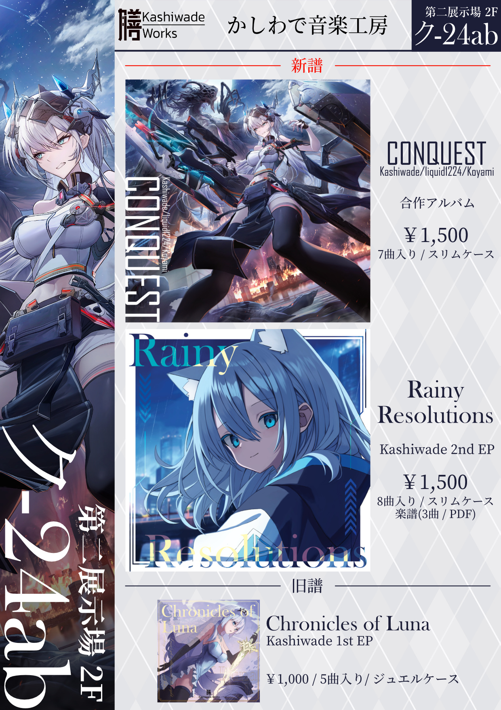

# Catalog

<!--

<a href="https://kashiwade.fanbox.cc/posts/5806990" class="spec-web-button" target="_blank">Click here for details...</a>

 
-->

<a href="https://kashiwade.work/special/rainy-resolutions" class="spec-web-button" target="_blank">About Rainy Resolutions</a>

