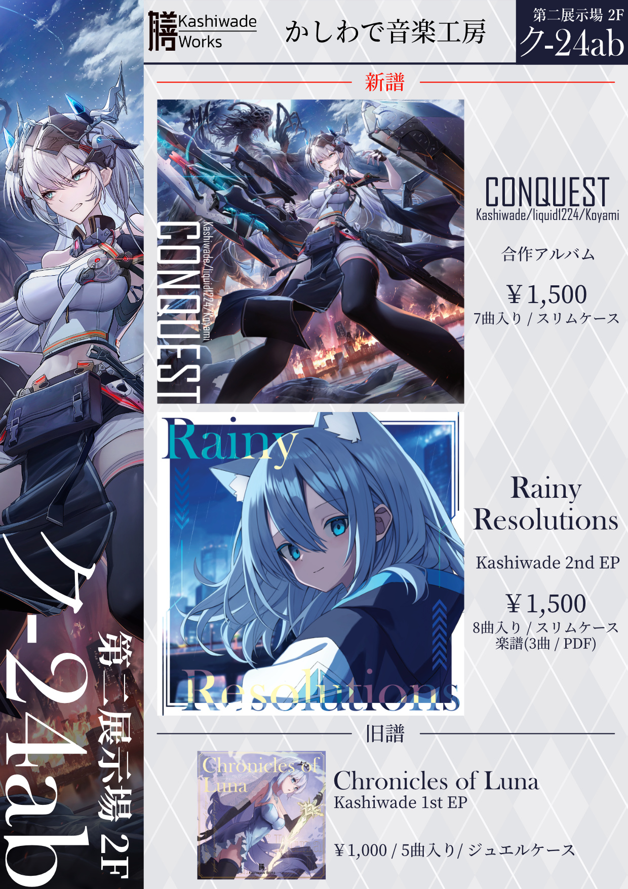

# Score
現在制作中ですので、以下のサンプルスコアの内容は大きく変更される可能性があります。自分で演奏しながら記譜を修正したり、演奏のしやすさを向上させたりしている所です。M3リリース後にも変更が加えられるかもしれません。

※ Resplendent Finale - Piano ver.の楽譜も制作中です。

# Catalog

<!--

<a href="https://kashiwade.fanbox.cc/posts/5806990" class="spec-web-button" target="_blank">Click here for details...</a>

 
-->

<a href="https://conquest.kashiwade.work" class="spec-web-button" target="_blank">About CONQUEST</a>

